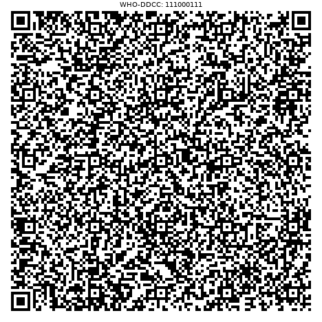
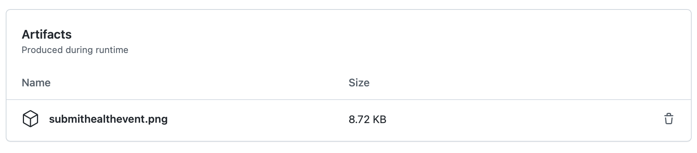

# Getting Up and Running

This page documents the test steps for the DDCC Implementation Guide (IG) and also and emphasizes the methodology for new learners about using FHIR-oriented artifacts. 

The IG used is:
* Published IG: https://worldhealthorganization.github.io/ddcc
* Code repository (with links to these docs): https://github.com/WorldHealthOrganization/ddcc

> While the acronym IG could be used to describe the tests tooling repository because it uses a FHIR IG template for publishing, the acronym IG means the whatever core conformance resources are the focus of the testing.

> Where paths in the repository start with a slash (/), what is meant is the root of the repository, not the filesystem.

## Methodology and Workflows

## Workflow Status

All builds should pass. The status badges show the outcomes from the GitHub Actions directly from GitHub.

| **Outcome** | **Workflow** |
| --- | --- |
|  | Build FSH using Sushi |
|  | Build IG using Publisher |
|  | DDCC:VS Generation Service |
|  | DDCC:VS Repository Service |


## IG Build Tests

> These are troubleshooting steps in creating and testing any IG, not only DDCC or adaptations of DDCC. A first question for an implementer modifying an IG is to confirm successful builds, squashed errors, and valid technical artifacts.

* Confirm that the IG completes the build process and produces valid artifacts. This is broken down into several steps.
    * If FSH is being used, confirm Sushi runs to completion.
    * Confirm a complete build which outputs the full website and technical artifacts in /output.
    * Publish the IG, for example using GitHub pages.
    * Address outstanding issues in the QA report at `qa.html`. Redo the above steps.

Any IG should be published and this process provides a helpful quality assurance report in qa.html. Once an IG is built, it puts all publishable resources in /output.

Many IGs use FHIR Shorthand (FSH) to create conformance resources and examples. DDCC uses FSH. FSH files are stored in IGs in /input/fsh. As a test, Sushi (aka "SUSHI Unshortens Short Hand Inputs") is run to generate JSON files from FSH files. Running this step indicates if there are any outstanding IG issues from the FSH files. This is helpful to do before running Publisher.

The `build_ig` workflow builds the DDCC Implementation Guide and outputs an artifact for the QA report. This is a different workflow than publishing an IG to GitHub Pages, for which DDCC is an [example](DDCC-ghpages).

[Publisher](https://github.com/HL7/fhir-ig-publisher) creates a full IG output including HTML pages using the Ruby-based Jekyll engine. A helpful output from Publisher is the QA report `qa.html`. This is captured during the workflow and provided as an artifact on the workflow page. When Publisher runs and the IG is published, the QA report is linked on the footer of the pages.

## Conformance-like Tests

### `Submit Health Event`

* Complete the `Submit Health Event` transaction to the `DDCC:VS Generation Service`
    * This involves having or creating fake data. All IGs should have example data for implementers to use.
    * Run `Submit Health Event`.
    * Confirm the response from the `DDCC:VS Generation Service` contains the QR code, either in PDF or PNG format. The [DDCC transactions mediator](https://github.com/openhie/ddcc-transactions-mediator) acts as the `DDCC:VS Generation Service`.
    * The PNG or PDF of QR Code can be saved for confirmation.

The test is located in `.github/workflows/submithealthevent.yaml` of [this respository](https://github.com/openhie/ddcc-tests). 

The test clones the [DDCC transactions mediator](https://github.com/openhie/ddcc-transactions-mediator) repository. In that repository there is a tests folder which has fake data, although fake data can be used from the [ddcc IG](https://github.com/WorldHealthOrganization/ddcc) in /output after running Publisher, or from data generated in the [bulk data](https://github.com/intrahealth/bulk-fsh) repo. See [fake data](fakedata.md).

The test sets up the repo...
```yaml
- name: Checkout instant
  uses: actions/checkout@v2
  with:
    repository: openhie/ddcc-transactions-mediator
```
...then launches the docker-compose and waits for the stack to be ready.
```yaml
- name: Launch ddcc mediator and hapi
  run: docker-compose up -d

# wait for stack to come up
- run: sleep 120
```

Now, let's break down the cURL request and response processing. 

```yaml
- name: Submit Health Event
  working-directory: tests
  run: |
    curl -X POST localhost:4321/ddcc/submitHealthEvent -d @Demo-Bundle-1.json -H "Content-type: application/fhir+json" | jq --raw-output '.entry[].resource.entry[].resource | select(.resourceType=="DocumentReference") | .content[].attachment | select(.contentType=="image/png") | .data' | base64 --decode > submithealthevent.png
```
The command POSTs the batch bundle of parameters which include the QuestionnaireResponse required for the transaction.
```sh
curl -X POST localhost:4321/ddcc/submitHealthEvent -d @Demo-Bundle-1.json -H "Content-type: application/fhir+json"
```
The next step uses the awesome [jq](https://stedolan.github.io/jq/) processing tool. What is does is get the raw output from stdout, and filters Then it looks for the content of type "image/png" and passes that Base64-encoded content without quotations to the next step.

Base64 is a way to represent binary data in an ASCII string format. It is commonly used in FHIR Resources to contain binary content.
```
| jq --raw-output '.entry[].resource.entry[].resource | select(.resourceType=="DocumentReference") | .content[].attachment | select(.contentType=="image/png") | .data'
```
The next step pipes the Base64 encoded output to the decoder to it becomes binary again, and writes it to a PNG image.
```sh
| base64 --decode > submithealthevent.png
```

<br clear="all">

GitHub Actions allows you to publish artifacts. These can be found on the Actions tab in [this respository](https://github.com/openhie/ddcc-tests). Navigate to the Actions tab, choose a workflow on the left, then choose a commit on the main view, and look at the bottom for the artifacts.


<br clear="all">

In GitHub Actions, this is done as so.
```yaml
- name: Store QR Code
  uses: actions/upload-artifact@v2
  with:
    name: submithealthevent.png
    path: tests/submithealthevent.png
```

### `Retrieve Health Certificate`

* Complete the `Retrieve Health Certificate` transaction by using an MHD transaction to obtain the document.
    * For the reference implementation, a FHIR server takes on the role of DDCC:VS Repository Service and Registry Service.
    * Since the `Submit Health Event` already returns the DocumentReference query response required by MHD, the above transaction satisfies the `Submit Health Event` transaction as well.
    * Artifact: PNG or PDF of QR Code

The `Submit Health Event` responds with the FHIR DocumentReference bundle, which includes the information of the `Retrieve Health Certificate` transaction as well. One cURL command can submit and return the QR code as above. But, formally in the specification there is a difference between the DDCC:VS Generation Service, DDCC:VS Registry, and DDCC:VS Repository Service.

The steps above are similar to `Submit Health Event`. The notable difference is in obtaining the `_id` of a DocumentReference, and then obtaining it. The post-processing of the response is the same in the test.

A notable difference is that another docker compose file is used which exposes the DDCC:VS Registry/Repository Services which in the tests are roles played by HAPI FHIR Server. This requires exposing ports.

```yaml
- name: Launch ddcc mediator and hapi
  run: docker-compose -f docker-compose.dev.yml up -d
```

The steps in GitHub Actions are to obtain a string of a recent `_id`, save that as an environment variable called `fhirid`, and then retrieve the document and process the cert into a PNG.
```yaml
- name: Retrieve cert
  working-directory: tests
  run: |
    fhirid=$(curl http://localhost:8080/fhir/DocumentReference | jq --raw-output .entry[0].resource.id)
    echo ${fhirid}
    curl http://localhost:8080/fhir/DocumentReference?_id=${fhirid} | jq --raw-output '.entry[].resource | select(.resourceType=="DocumentReference") | .content[].attachment | select(.contentType=="image/png") | .data' | base64 --decode > retrievecert.png
```

